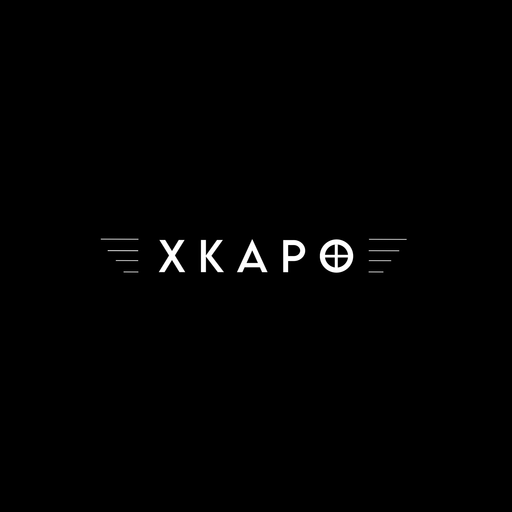

<!DOCTYPE html>
<html lang="en">
<head>
    <meta charset="UTF-8">
    <meta name="viewport" content="width=device-width, initial-scale=1.0, maximum-scale=1.0, user-scalable=no">
    <title>XKAPO | Authority</title>
    
</head>
<body>

    

        
    

    

        

        

        

    

    

        <nav>
            
XKAPO

            <a href="tel:+389070878227" class="contact-btn">CONTACT</a>
        </nav>

        

            

            
            

            

            

            

            

        

    

    
</body>
</html>
